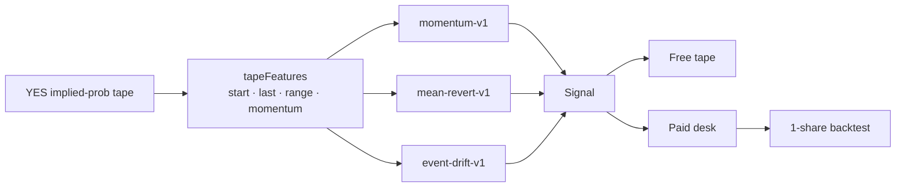
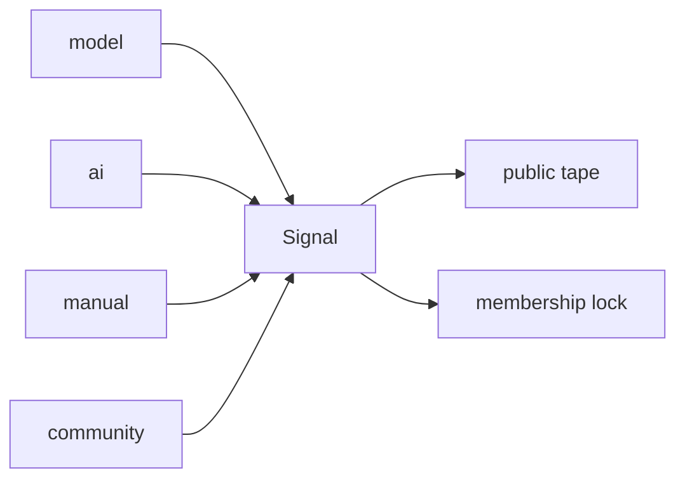
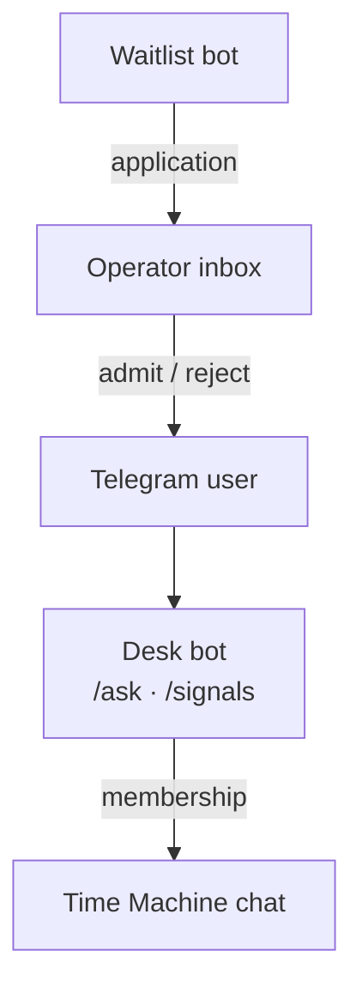

# Cypherpunk

Telegram-first Polymarket research desk. Free tape is public. Paid desk unlocks the full feed and backtests with **USDC on Solana**.

This is research, not auto-trading, and not financial advice.

| [The model](docs/MODEL.md) | [How it works](docs/HOW_IT_WORKS.md) | [License (MIT)](LICENSE) |
| --- | --- | --- |

**Site:** [cypherpunk-code.com](https://www.cypherpunk-code.com/)
· **Waitlist:** [@Cypherpunk_Waitlist_bot](https://t.me/Cypherpunk_Waitlist_bot)

## The model

A YES token is already a chance, like a weather report. We watch whether that number walked up, walked down, or barely moved. Three toy rules may speak. The AI desk only narrates the result. It does not invent a second forecast.

$$
\Delta = p_{\text{last}} - p_{\text{start}}
$$

- Ball still rolling → lean with the walk
- Rubber band too stretched from 50¢ → lean the other way
- Early tape and late tape blow the same way → lean with that wind
- Tiny wobble → say nothing

Diagrams, the four numbers, and the kid-level formulas: **[docs/MODEL.md](docs/MODEL.md)**

## Time machine



A tiny wiggle is not a call. Rules return `null` unless the move is clear.

## One object

Model rules, AI notes, desk calls, and community ideas all land on the same `Signal`.

```ts
type Signal = {
  market: string
  side: "yes" | "no"
  confidence: number
  rationale: string
  source: "model" | "ai" | "manual" | "community"
  tier: "free" | "paid"
  strategyId?: "momentum-v1" | "mean-revert-v1" | "event-drift-v1"
}
```



Free fields are public. Paid fields never leave the server until membership is active.

## Desk

Strangers apply on the waitlist bot. The operator admits by hand. Testers chat in Telegram. Paid members can also open a **Time Machine** chat box in the desk bot and ask in plain words.



## How to start

[Join the waitlist](https://t.me/Cypherpunk_Waitlist_bot). Access is reviewed by hand. If you're in, the bot messages you.

## License

[MIT](LICENSE). Methodology docs are part of the same grant: read them, fork the ideas, do not treat them as a trading bot.

## Founder

[Anon Rothschild](https://github.com/9lordisgod) · [@williemdoe](https://x.com/williemdoe)
