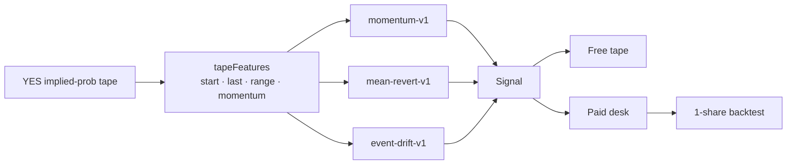
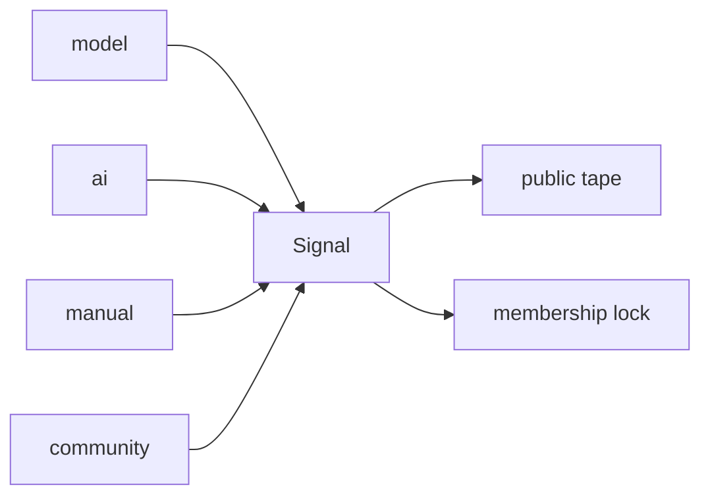
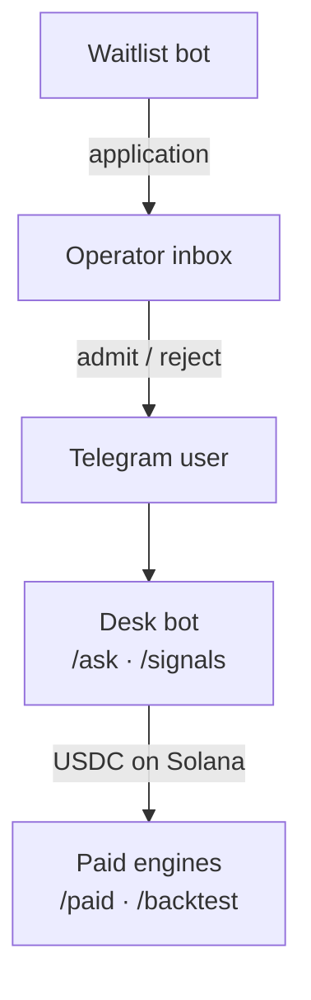

# Cypherpunk

Telegram-first Polymarket research desk. Free tape is public. Paid desk unlocks the full feed and backtests with **USDC on Solana**.

This is research, not auto-trading, and not financial advice.

**Site:** [cypherpunk-code.com](https://www.cypherpunk-code.com/)
· **Waitlist:** [@Cypherpunk_Waitlist_bot](https://t.me/Cypherpunk_Waitlist_bot)
· **Methodology:** [docs/HOW_IT_WORKS.md](docs/HOW_IT_WORKS.md)

## Time machine

A Polymarket YES token is already a probability. We reduce the series to a few numbers, then three independent rules either fire a call or stay silent.



A tiny wiggle is not a call. Rules return `null` unless the move clears a threshold.

## One object

Model rules, AI notes, desk calls, and community ideas all land on the same `Signal`.

```ts
type Signal = {
  market: string
  side: "yes" | "no"
  confidence: number
  rationale: string
  source: "model" | "ai" | "manual" | "community"
  tier: "free" | "paid"
  strategyId?: "momentum-v1" | "mean-revert-v1" | "event-drift-v1"
}
```



Free fields are public. Paid fields never leave the server until membership is active.

## Desk

Strangers apply on the waitlist bot. The operator admits by hand. The desk is Telegram chat, not a web tab.



## How to start

[Join the waitlist](https://t.me/Cypherpunk_Waitlist_bot). Access is reviewed by hand. If you're in, the bot messages you.

## Founder

[Anon Rothschild](https://github.com/9lordisgod) · [@williemdoe](https://x.com/williemdoe)
