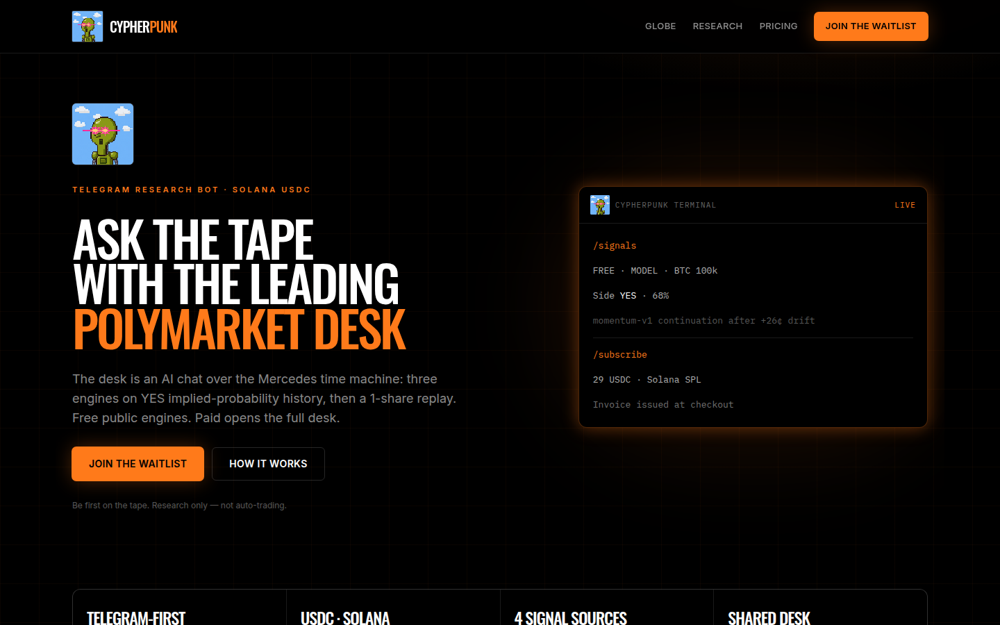
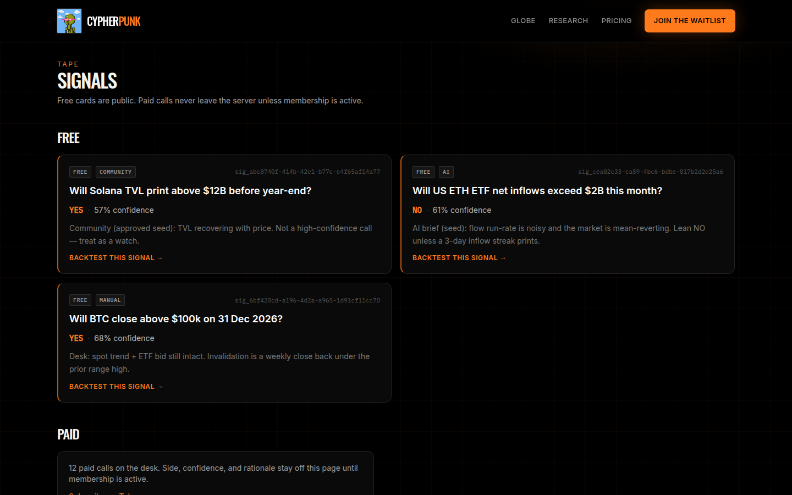
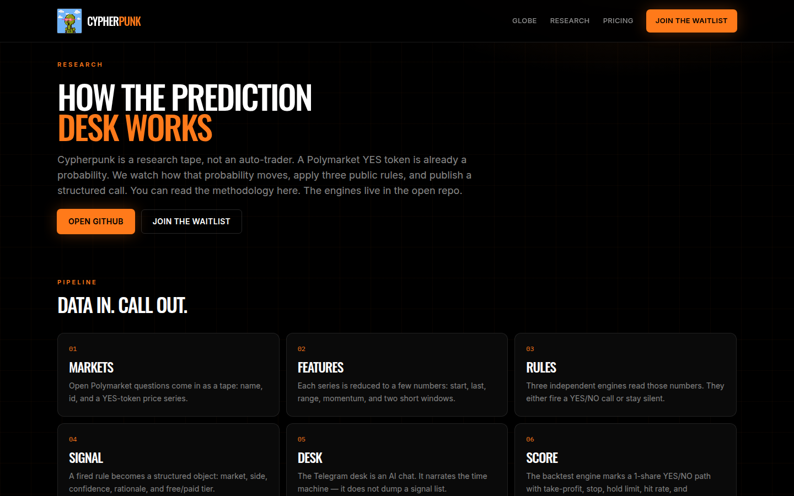

# Cypherpunk

Telegram-first Polymarket research desk. Free tape is public. Paid desk unlocks the full feed and backtests with **USDC on Solana**.

This is research, not auto-trading, and not financial advice.

**Site:** [cypherpunk-code.com](https://www.cypherpunk-code.com/)

**Waitlist:** [Cypherpunk Waitlist bot](https://t.me/Cypherpunk_Waitlist_bot)

**Founder:** [Willie / @williemdoe](https://x.com/williemdoe)

**How it works:** [docs/HOW_IT_WORKS.md](docs/HOW_IT_WORKS.md)

## What users get

- Free signals in Telegram and on the web
- Paid desk for the full tape and backtests
- Model, AI, desk, and community calls on one Signal object
- Membership in USDC on Solana only

## How the desk works

A Polymarket YES token is already a probability. Three public engines read that tape and publish a structured call. The Telegram desk narrates it. Methodology is in [docs/HOW_IT_WORKS.md](docs/HOW_IT_WORKS.md).

## How to start

[Join the waitlist](https://t.me/Cypherpunk_Waitlist_bot)

Access is reviewed by hand. If you're in, the bot messages you.

## Founder

[Anon Rothschild](https://github.com/9lordisgod) · [@williemdoe](https://x.com/williemdoe)
