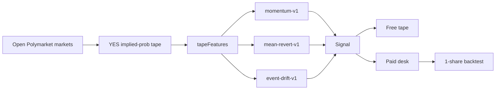

# How Cypherpunk predictions work

Cypherpunk is a **research tape**, not an auto-trader. A Polymarket YES token is already a probability. We watch how that probability moves and publish a structured call: market, side, confidence, and a short rationale.

Kid-level picture (diagrams + formulas, no private ops): [MODEL.md](MODEL.md)

## Why it works

1. **Implied probability** — a YES token at 64¢ means the tape is pricing a 64% chance. That number is the input.
2. **Continuation** — informed flow and attention often arrive in bursts. If the tape already moved, the next print is more likely to keep going than to instantly fade.
3. **Stretch fade** — when a contract swings far from 50¢ without resolving, positioning can get crowded. The other engine fades that extension.

Rules stay silent when the tape is unclear. A tiny wiggle is not treated as certainty.

## Pipeline

## Four sources, one call

| Source | What it is |
| --- | --- |
| Model | Rules over the YES-price tape |
| AI | Desk research note |
| Desk | Human-curated call |
| Community | User idea, published only after review |

Free users see the public tape in full. Paid fields stay locked until membership is active.

## Backtest

Paid members can score a call as research: one-share path, take-profit / stop / hold limit, hit rate, drawdown. No fees, no slippage. A score, not a fill.

## Honest limits

- Research, not live execution of user funds
- Not a black-box neural net pitched as magic
- Not financial advice

## Founder

Willie — [x.com/williemdoe](https://x.com/williemdoe)
