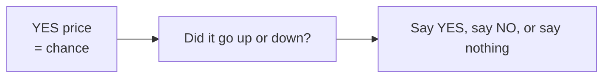
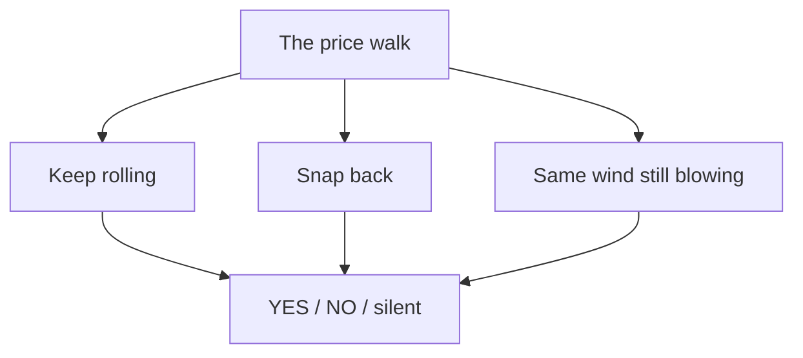
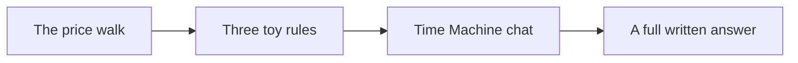

# The model

This is the **basic** picture. Not the full recipe. No magic black box.

Think of a Polymarket YES token like a weather report. If it costs **64¢**, the tape is saying “about 64% yes.” That number already is the forecast. We do not invent a new probability from nowhere. We watch how that number **moves**.

## The only numbers we need

A market is a line of prices over time. We boil that line down to four easy facts:

$$
p_{\text{start}} = \text{first price}
$$

$$
p_{\text{last}} = \text{newest price}
$$

$$
\Delta = p_{\text{last}} - p_{\text{start}}
$$

$$
\text{range} = p_{\text{max}} - p_{\text{min}}
$$

- **Δ** is “how far did it walk?”
- **range** is “how wild was the path?”

If the walk is tiny, we shut up. A wobble is not a call.

## Three toy rules

Three small rules look at the same walk. They do not vote in a neural net. Each one may speak, or stay quiet.

### 1. Keep rolling

A ball already rolling often keeps rolling for a bit.

If the price **walked up a lot**, this rule leans **YES**.  
If it **walked down a lot**, this rule leans **NO**.

$$
\text{if } \Delta \text{ is clearly up } \rightarrow \text{YES}
$$

$$
\text{if } \Delta \text{ is clearly down } \rightarrow \text{NO}
$$

$$
\text{if } \Delta \text{ is tiny } \rightarrow \text{silent}
$$

### 2. Snap back

A rubber band stretched far from the middle often wants to come back.

**50¢** is the middle (a coin flip). If the price ran a long way from 50¢ and the question is not over, this rule fades the stretch.

$$
\text{if price is high above } 50¢ \rightarrow \text{NO}
$$

$$
\text{if price is low below } 50¢ \rightarrow \text{YES}
$$

$$
\text{if it never stretched } \rightarrow \text{silent}
$$

### 3. Same wind

If the **early** part of the tape and the **late** part both moved the same way, maybe the same story is still playing.

$$
\text{if early }\Delta\text{ and late }\Delta\text{ have the same sign } \rightarrow \text{keep that side}
$$

$$
\text{if they disagree, or the late move is tiny } \rightarrow \text{silent}
$$

## What the AI is

The chat box is a talker, not a second secret model. It reads the walk and the three toy rules, then explains in words. Paid members can ask freely. It should not invent a new number from vibes.

## What a call looks like

When a rule speaks, it writes a small card:

| Field | Kid version |
| --- | --- |
| market | Which question |
| side | YES or NO |
| confidence | How sure the rule feels |
| rationale | One sentence why |
| source | rule, AI note, human, or community |

Community ideas wait for a human. Paid fields stay locked until membership is on.

## Honest limits

- Research tape, not a robot that spends your money
- Simple rules on a public kind of number, not a hidden brain
- Silence is a feature
- Not financial advice

Full methodology (still public, still not the private ops): [HOW_IT_WORKS.md](HOW_IT_WORKS.md)

License: [MIT](../LICENSE)
